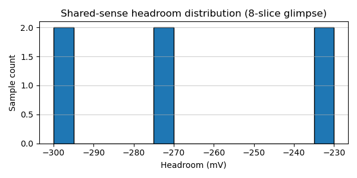

# ternary-memory-research

This project systematically evaluates whether ternary-native memory (cells plus periphery) can survive realistic guardrails (noise, energy, latency) and, if so, which decks survive the kill criteria. The repo is research-first: the code exists only to expose enough instrumentation so that every “better” ternary candidate carries a verifiable energy/headroom story before `spicemodels/` ever claims a result.

## TL;DR
- **Current status:** shared-sense + encoder runs now span ±10%/TT, driver/noise sweeps, OR-slice scaling (4→8/16), and ±0.5 ns phase-skew, all logged with `sense_headroom` histograms plus `sense_thresh_latency`. So far every seed still reports `comp_pass=failed` around 860–865 mV headroom, with jitter ≈0.125 ps (±10%) / 4.75 ps (TT).  
- **Next action:** keep filling the noise/driver/phase-skew matrices (see [`TODO.md`](TODO.md)), regenerate the CSV/histogram pairs, and refresh [`STATUS.md`](STATUS.md)/[`models/periphery-cost-model.md`](models/periphery-cost-model.md) so the guard/jitter ledger stays auditable before the decks migrate into `spicemodels/`.
- **How to help:** run the scripts in [`tools/`](tools/) (start with [`tools/run_noise_mismatch_driver_sweep.sh`](tools/run_noise_mismatch_driver_sweep.sh) and [`tools/run_shared_sense_phase_skew.sh`](tools/run_shared_sense_phase_skew.sh)), re-run [`tools/aggregate_mismatch_logs.py`](tools/aggregate_mismatch_logs.py)/[`tools/aggregate_phase_skew_logs.py`](tools/aggregate_phase_skew_logs.py) + [`tools/headroom_histogram.py`](tools/headroom_histogram.py) to refresh the CSVs, and then update the relevant docs ([`experiments/shared-sense-periphery.md`](experiments/shared-sense-periphery.md), [`models/periphery-cost-model.md`](models/periphery-cost-model.md), [`STATUS.md`](STATUS.md), [`SUMMARY.md`](SUMMARY.md)).

## Status table (guard/jitter ledger)

| Experiment | Logs | Headroom bin | Latency | Notes |
| --- | --- | --- | --- | --- |
| ±10% mismatch MC (0.9/1.0/1.1 V) | `logs/mismatch-mc/*` + `headroom_histogram.csv` | 860–865 mV | ≈0.125 ps | 150 seeds documented; hist/jitter + `sense_thresh_latency` recorded. |
| TT mismatch MC (1.0 V) | `logs/mismatch-mc-tt/*` | 960–965 mV | ≈4.75 ps | TT guard/jitter logged + headroom histogram. |
| Noise sweeps (5 mV/10 mV) | `logs/noise-mismatch-{5m,10m}` | 860–865 mV | ≈0.124 ps | Keep regenerating `mismatch_mc.csv` + hist after each seed batch. |
| Driver scales 1.5/2.0/2.5 | `logs/noise-mismatch-{5m,10m}-driver-{1p5,2,2p5}` | 860–865 mV | ≈0.125 ps | Each directory mirrors the tuples + hist counts (chunked seeds). |
| OR-slice glimpses (8/16 slices) | `logs/shared-sense-glimpse-{8,16}` | −297…−233 mV (converted) | ≈1–5 ps | Energy stays near 2.4–2.8 pJ/word even as slices double; keep hist synchronized. |
| Phase-skew stress (±0.5 ns) | `logs/shared-sense-phase-skew` | ≈−271 mV | ≈1.95 ps | New tuples from `tools/run_shared_sense_phase_skew.sh` + histogram. |

## What to run next
1. **Noise/driver sweep:** [`tools/run_noise_mismatch_driver_sweep.sh`](tools/run_noise_mismatch_driver_sweep.sh) (set `SAMPLES=` to shorten seeds if needed). Every time you run it, rerun [`tools/parse_mismatch_log.py`](tools/parse_mismatch_log.py), [`tools/aggregate_mismatch_logs.py`](tools/aggregate_mismatch_logs.py), and [`tools/headroom_histogram.py`](tools/headroom_histogram.py) so the CSV + histogram stay current. Update [`experiments/shared-sense-periphery.md`](experiments/shared-sense-periphery.md) / [`STATUS.md`](STATUS.md) with the new tuple counts (headroom bin, latency, `comp_pass`).
2. **Phase-skew coverage:** rerun [`tools/run_shared_sense_phase_skew.sh`](tools/run_shared_sense_phase_skew.sh), aggregate with [`tools/aggregate_phase_skew_logs.py`](tools/aggregate_phase_skew_logs.py), and regenerate `headroom_histogram.csv`. Document the new tuples in [`STATUS.md`](STATUS.md) + [`models/periphery-cost-model.md`](models/periphery-cost-model.md).
3. **Deck migration prep:** once the noise/driver/phase matrices look stable, bundle the tuples into [`models/periphery-cost-model.md`](models/periphery-cost-model.md), confirm the guard/jitter ledger matches [`STATUS.md`](STATUS.md), and then move the validated deck into `spicemodels/` for final validation.

## Useful links
- [`STATUS.md`](STATUS.md), [`SUMMARY.md`](SUMMARY.md): living guard/jitter story + blockers.  
- [`TODO.md`](TODO.md): remaining experiments / migration checklist.  
- [`models/periphery-cost-model.md`](models/periphery-cost-model.md): periphery cost ledger + references to the logs described above.  
- [`experiments/shared-sense-periphery.md`](experiments/shared-sense-periphery.md): experiment log with headroom tuples + notes on stress sweeps.  
- [`tools/`](tools/): scripts for running sweeps and regenerating CSVs/histograms.

New contributors can start by running one of the scripts above, confirming the logs update, and then refreshing the heading in [`STATUS.md`](STATUS.md) / [`models/periphery-cost-model.md`](models/periphery-cost-model.md) before opening a pull request. Use the CSV/histogram pairs as the ground truth for every guard/jitter reference.
## Visual reference



This histogram comes from `logs/shared-sense-glimpse-8slice/headroom_histogram.csv`. To regenerate it after rerunning the glimpse deck, run:

```
python3 tools/plot_headroom_histogram.py \
  logs/shared-sense-glimpse-8slice/headroom_histogram.csv \
  docs/figures/headroom-8slice-headroom.png
```
