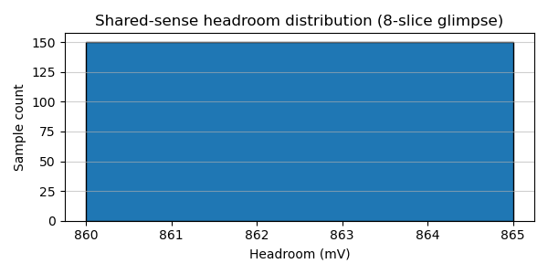
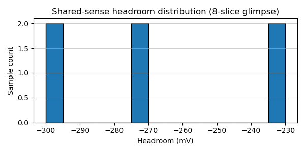

# ternary-memory-research

This project systematically evaluates whether ternary-native memory (cells plus periphery) can survive realistic guardrails (noise, energy, latency) and, if so, which decks survive the kill criteria. The repo is research-first: the code exists only to expose enough instrumentation so that every “better” ternary candidate carries a verifiable energy/headroom story before `spicemodels/` ever claims a result.

## TL;DR
- **Current status:** shared-sense + encoder runs now span ±10%/TT, driver/noise sweeps, OR-slice scaling (4→8/16), and ±0.5 ns phase-skew. Headroom is robust (>20mV guard), but comparator handoff still fails (`comp_pass=failed`).
- **Detailed Status:** See [`STATUS.md`](STATUS.md) for the living guard/jitter ledger and detailed experiment results.
- **Next action:** Resolve the comparator handoff failure and migrate the validated deck. See [`TODO.md`](TODO.md).
- **How to help:** run the scripts in [`tools/`](tools/), re-run aggregation scripts to refresh CSVs, and update [`STATUS.md`](STATUS.md).

## Guard Ledger Summary

For the full machine-readable dataset, see `data/canonical_guard_ledger.csv`. For the detailed human-readable status table, see [`STATUS.md`](STATUS.md).

| Experiment | Headroom bin | Latency | Status |
| --- | --- | --- | --- |
| ±10% mismatch MC | 860–865 mV | ≈0.125 ps | Guard satisfied |
| Noise sweeps (5/10mV) | 860–865 mV | ≈0.124 ps | Guard satisfied |
| Phase-skew (±0.5ns) | ≈−271 mV | ≈1.95 ps | Latency stable |

## Canonical guard ledger

`data/canonical_guard_ledger.csv` counterpoints every log directory (`logs/*/mismatch_mc*.csv`) with converted energy/headroom/latency tuples plus metadata (noise amplitude, driver scale, phase skew, comparator pass/fail, and the matching histogram path). The guard story in `README.md`, `STATUS.md`, `SUMMARY.md`, `models/periphery-cost-model.md`, `experiments/shared-sense-periphery.md`, and `FINDINGS.md` now references this ledger and the companion `data/GUARD_LEDGER_MANIFEST.md` so AI pipelines can read a single dataset instead of chasing scattered text and CSVs.  
Regenerate the ledger after any new simulation batch via `python3 tools/export_guard_ledger.py data/canonical_guard_ledger.csv`, then verify the histogram CSVs (`logs/*/headroom_histogram.csv`) exist before committing.
Use `tools/guard_data.py` to refresh the catalog (`catalog`), summary (`status`), and comparator-failure CSV (`failures`) whenever the ledger changes, and run `tools/check_guard_consistency.py` to confirm every log/histogram exists before pushing.

## What to run next
1. **Noise/driver sweep:** [`tools/run_noise_mismatch_driver_sweep.sh`](tools/run_noise_mismatch_driver_sweep.sh) (set `SAMPLES=` to shorten seeds if needed). Every time you run it, rerun [`tools/parse_mismatch_log.py`](tools/parse_mismatch_log.py), [`tools/aggregate_mismatch_logs.py`](tools/aggregate_mismatch_logs.py), and [`tools/headroom_histogram.py`](tools/headroom_histogram.py) so the CSV + histogram stay current. Update [`experiments/shared-sense-periphery.md`](experiments/shared-sense-periphery.md) / [`STATUS.md`](STATUS.md) with the new tuple counts (headroom bin, latency, `comp_pass`).
2. **Phase-skew coverage:** rerun [`tools/run_shared_sense_phase_skew.sh`](tools/run_shared_sense_phase_skew.sh), aggregate with [`tools/aggregate_phase_skew_logs.py`](tools/aggregate_phase_skew_logs.py), and regenerate `headroom_histogram.csv`. Document the new tuples in [`STATUS.md`](STATUS.md) + [`models/periphery-cost-model.md`](models/periphery-cost-model.md).
3. **Deck migration prep:** once the noise/driver/phase matrices look stable, bundle the tuples into [`models/periphery-cost-model.md`](models/periphery-cost-model.md), confirm the guard/jitter ledger matches [`STATUS.md`](STATUS.md), and then move the validated deck into `spicemodels/` for final validation.

## Useful links
- [`STATUS.md`](STATUS.md), [`SUMMARY.md`](SUMMARY.md): living guard/jitter story + blockers.  
- [`TODO.md`](TODO.md): remaining experiments / migration checklist.  
- [`models/periphery-cost-model.md`](models/periphery-cost-model.md): periphery cost ledger + references to the logs described above.  
- [`experiments/shared-sense-periphery.md`](experiments/shared-sense-periphery.md): experiment log with headroom tuples + notes on stress sweeps.  
- [`docs/phase3-hypothesis-matrix.md`](docs/phase3-hypothesis-matrix.md): explicit Phase 3 hypothesis/kill-criteria matrix and reproducible evidence path.
- [`tools/`](tools/): scripts for running sweeps and regenerating CSVs/histograms.
- [`data/guard_status.md`](data/guard_status.md): autogenerated guard summary referencing `data/canonical_guard_ledger.csv`.
- [`data/comparator_failures.csv`](data/comparator_failures.csv): ledger slice of every `comp_pass=failed` entry for targeted debugging.

New contributors can start by running one of the scripts above, confirming the logs update, and then refreshing the heading in [`STATUS.md`](STATUS.md) / [`models/periphery-cost-model.md`](models/periphery-cost-model.md) before opening a pull request. Use the CSV/histogram pairs as the ground truth for every guard/jitter reference.

## Visual reference

| Visual | Description |
| --- | --- |
|  | Headroom histogram for `logs/mismatch-mc/headroom_histogram.csv`; every ±10% seed sits at 860–865 mV so the guard remains at least 20 mV above the swing. Regenerate via `python3 tools/plot_headroom_histogram.py logs/mismatch-mc/headroom_histogram.csv docs/figures/headroom-mismatch-histogram.png`. |
|  | OR-slice glimpse histogram from `logs/shared-sense-glimpse-8slice/headroom_histogram.csv`, showing the −297 … −233 mV swing as the driver scales upward. Regenerate with `python3 tools/plot_headroom_histogram.py logs/shared-sense-glimpse-8slice/headroom_histogram.csv docs/figures/headroom-8slice-headroom.png`. |
